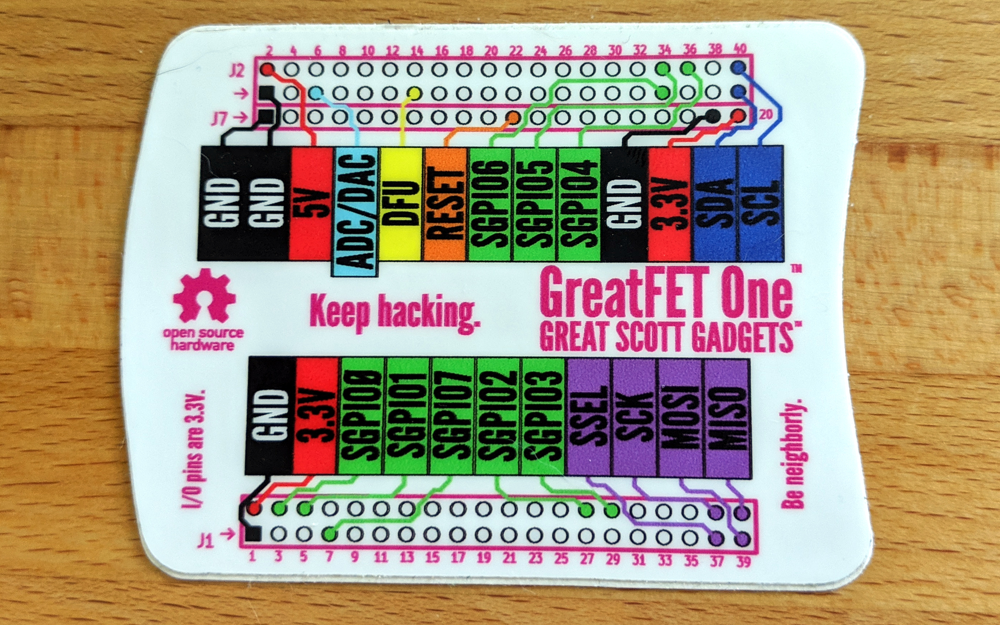

================================================
How to Design a Neighbor
================================================

This guide will help you design a neighbor, an add-on board for GreatFET.

Use a Template
~~~~~~~~~~~~~~

The easiest way to get started is to use a neighbor template with KiCad to edit the design. Clone the `neighbor-template <https://github.com/greatfet-hardware/neighbor-template>`__ repository locally:

.. code-block :: sh

	git clone https://github.com/greatfet-hardware/neighbor-template.git

Then in KiCad select File > New > Project from Template. In the Project Template Selector click the User Templates tab and then click the Browse button. In the file browser select the neighbor-template directory. Two GreatFET Neighbor icons should now appear in the Project Template Selector. Select either the two-layer template or the four-layer template depending on how many copper layers you would like your PCB to have and click OK.

Type a name for your project and have fun designing it! In the schematic editor you will see some components that have already been added for you. Some of these are required (see below), and others are optional elements that you may wish to delete. Pay attention to the various tips below while you work on your design.

If this is your first time using KiCad, you may wish to go through `Getting to Blinky <https://contextualelectronics.com/courses/getting-to-blinky-5-0/>`__ or one of the other `KiCad tutorials <https://www.kicad.org/help/learning-resources/>`__ before editing your neighbor.

Required Elements
~~~~~~~~~~~~~~~~~

Every neighbor should connect to both of the 2x20, 2.54mm pin headers (J1 and J2) on GreatFET. You can use female stackable headers mounted on the top of your neighbor, or you can use male headers mounted on the bottom if you do not want your neighbor to be stackable. For mechanical stability, use 2x20 headers (not headers with fewer pins) even if you don't need to use very many pins.

Our favorite header part is Samtec SSQ-120-23-G-D, but it is a bit expensive due to the gold plating and low insertion force features. Any female header from the Samtec SSQ series with 10 mm post length (e.g. SSQ-120-03-T-D) should be fine. To get the correct post length, look for a "3" in the last numeric position of the part number (SSQ-xxx-x3-x-x). An important feature of the SSQ series is that the posts have a square cross sections. We have experienced unreliable connections with lower cost headers that have flat, rectangular post cross sections.

Except for +5V, all pins on the neighbor interface are referenced to 3.3 V.

You may power your neighbor from the 3.3 V supply (VCC) provided by the GreatFET, but a stack of neighbors may draw a total of only 150 mA from this supply. If you need more current or a different voltage, use +5V on J2 and implement your own voltage regulation. As a general rule, if your neighbor draws more than 50 mA consider adding your own voltage regulation to ensure that other neighbors are able to draw from VCC.

Bonus Row
~~~~~~~~~

The bonus row of pins (J7) is not required. Design your neighbor without using bonus row pins if you can. However, you may wish to keep J7 as an unpopulated header anyway (see Orientation below).

Orientation
~~~~~~~~~~~

It is possible for a user to plug in a neighbor rotated 180 degrees. This could be very bad! In order to discourage such accidents, give the user visual cues that indicate the correct orientation.

The most obvious visual cue is the PCB shape. Use the template to match the shape of the GreatFET. If you need a different shape, try to maintain aspects of the GreatFET shape, especially the curved west edge, to help the user recognize the orientation. Alternatively you could indicate the curves with markings on the silkscreen layer of your neighbor.

Another cue is the position of the mounting holes. The west mounting holes are closer together than the east mounting holes. Your neighbor should have all four mounting holes if possible. Be careful not to place components or route traces through the keep-out area around each mounting hole.

A third cue is the bonus row (J7). Even if you don't need the bonus row, keep J7 as an unpopulated header if you can. This makes the orientation easy to see, and it also allows the user to install a stackable header in J7 if desired.

Last, orient any major text in the same way as the title text on GreatFET.

Neighbor Identification
~~~~~~~~~~~~~~~~~~~~~~~

It is neighborly to enable automated detection of your neighbor. We like I2C for this because any number of neighbors can be detected over the same pair of I2C pins without conflict. If you have a use for an I/O expander or other I2C device on your neighbor, configure it with a unique address and reserve that address on the :ref:`I2C Registry <I2C_Registry>`. Document your I2C address in 7-bit format even if the datasheet for your I2C part uses 8-bit format.

If you don't have a use for any particular I2C function, consider using an I2C EEPROM for identification. We've added one to the template to make this easy. This will allow your neighbor to participate in our scheme for identifying multiple neighbors that all share an I2C address on their EEPROMs.

The EEPROM is optional; you can remove it if you don't want it. In most of our designs we have removed the EEPROM and instead have used another I2C device with a unique address. If you're not sure whether or not you want to keep the EEPROM in your design, we suggest that you do. You can always choose to not populate it.

Making Your Neighbor Extra-neighborly
~~~~~~~~~~~~~~~~~~~~~~~~~~~~~~~~~~~~~

An extra-neighborly neighbor is stackable and allows the user maximum flexibility and hackability. Even if you haven't thought of an application that would require stacking of your neighbor with other neighbors, install stackable headers if you can.

Unfortunately not all neighbors will be electrically compatible with each other even if they fit together mechanically, but there are some things you can do to maximize compatibility.

If you have an option to use I2C as the primary interface to your neighbor, use it and configure your neighbor with an I2C address that is unused by other neighbors. :ref:`I2C Registry <I2C_Registry>` your I2C address on this wiki. If you can provide solderable jumpers or some other means for a user to reconfigure the I2C address on your neighbor, do so. This could allow a user to solve unforeseen conflicts or to use multiple copies of your neighbor simultaneously. See `Crocus <https://github.com/greatfet-hardware/crocus>`__ for an example. Document your I2C address in 7-bit format even if the datasheet for your I2C part uses 8-bit format.

Solder jumpers can also be used to provide alternative pin selections for any pin. See `Begonia <https://github.com/greatfet-hardware/begonia>`__ for an example.

If your neighbor uses SPI as its primary interface, consider ways to avoid conflicts with your chip select pin. One way would be to use an I2C I/O expander for your chip select. See `Crocus <https://github.com/greatfet-hardware/crocus>`__ for an example.

Use no more power than you need. Stacked neighbors may only draw a total of 150 mA from the 3.3 V supply, so a power hungry neighbor may be incompatible with other neighbors. We like to add a voltage regulator to neighbors that can draw more than 50 mA. Also don't draw current when you don't need it. A great option is providing the ability to switch on and off a voltage regulator or load switch from an I2C I/O expander.

Provide a way to power down or disable your neighbor so that it does not draw power or unnecessarily load I/O pins while it is not in use. Two neighbors that are not compatible for simultaneous use may still be compatible if only one is enabled at a time by software.

Do not load analog pins when you don't need to. There is a very limited number of ADC/DAC pins, so conflicts are quite likely. It may make sense to use a small analog switch to enable or disable a connection to one of these pins. See `Jasmine <https://github.com/greatfet-hardware/jasmine>`__ for an example. Another option is to provide your own ADC or DAC. This can be a good option if you expect your neighbor to use the analog function 100% of the time. See `Gladiolus <https://github.com/greatfet-hardware/gladiolus>`__ for an example of both.

Break out all your pins. If your neighbor has a component with unused pins, break them out to test points or unpopulated headers so that future people can experiment with them if desired.

Pin Selection
~~~~~~~~~~~~~

Choosing which pins (on J1, J2, and J7) to use for your neighbor can be a tricky process because there are so many options! These tips can help:

* If your neighbor uses a common function such as I2C or SPI that is labeled on the GreatFET One pinout sticker, use the pins suggested by the sticker.

	* exception: The default CS (SPI chip select) can be used by only one SPI peripheral at a time. It is labeled on the sticker so that people plugging in an external device have an easy-to-find default. You should use some other GPIO pin or a pin controlled by an I2C I/O expander for this function.

	* exception: The default ADC/DAC pin can be used by only one analog circuit at a time. It is similarly labeled for external use. Avoid using it for your neighbor unless you expect it to be used sparingly and you provide a way to switch off loading of that pin.

* Avoid using pins on the sticker for functions other than the use labeled on the sticker. For example, you could use J1 pin 40 for GPIO instead of for SPI CIPO, but doing so would be a poor practice because other users and neighbor designers will expect that pin to be available for its CIPO function.

* If your neighbor requires high speed parallel streaming with up to 16 pins, the SGPIO peripheral is probably your best choice. There are various SGPIO pins available, but we have defined a set of default pin assignments (shown on the sticker and used by greatfet logic) for 8-pin interfaces. Be aware that you will probably not be able to use SGPIO simultaneously with another neighbor using SGPIO.

* Use the pinout tables in the Azalea README file (hint: clone the repository and view the file locally) or this interactive table to find pins that have functions you require.

* If there is a neighbor that you specifically hope will be compatible with your neighbor, check its documentation and design files to find out what pins it uses.

